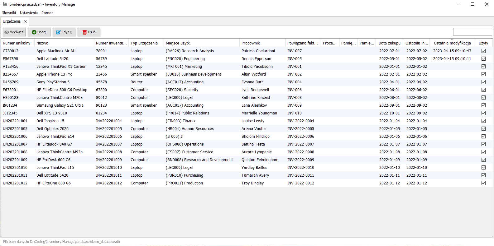
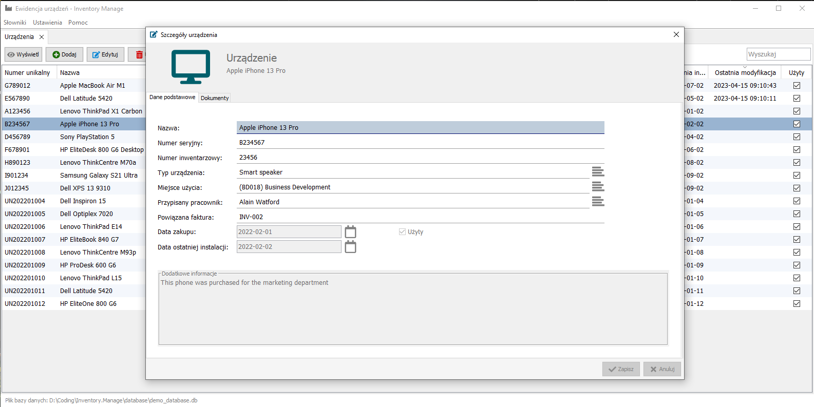
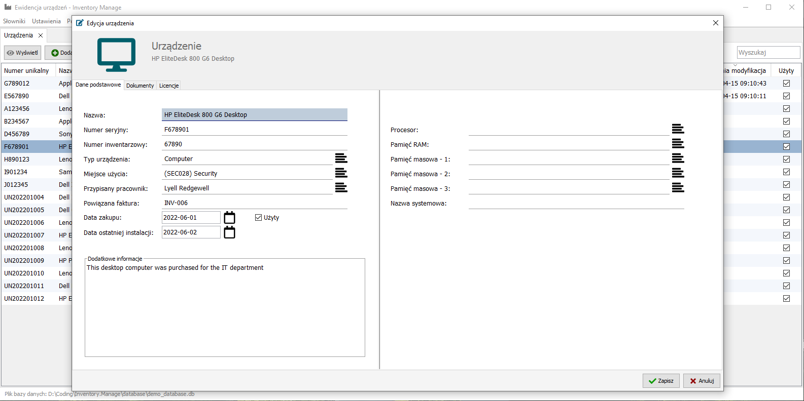

# Inventory Manage

## Table of Contents

- [General Info](#general-information)
- [Technologies Used](#technologies-used)
- [Setup](#setup)
- [Project Status](#project-status)
- [External Libraries](#external-libraries)
- [Screenshots](#screenshots)
- [Demo Video](#demo-video)

## General Information

> A project written in pure Java, as part of self-learning and entertainment.
> It is used to catalog equipment, assign a category to a device, an employee who uses a given equipment, add a date of purchase or an additional description.
> If it is a computer or laptop category, you can add the specification (processor, ram, mass storage or computer name).
> In the program, you can also add documents, e.g. in the PDF extension, where we have quick access to them, and they can also be attached to devices as attachments.
> Also you can saving program licenses in the form of keys and assigning them to devices such as a computer or laptop.

## Technologies Used

- Java 11
- SQLite 3.39.2

## Setup

1. Go to the `"Releases"` tab on the GitHub repository page.
2. Find the latest release of `"Inventory Manage"` and download the `"Inventory Manage.zip"` file.
3. Unzip the downloaded file to your preferred location.
4. Make sure you have Java installed on your machine.
5. In the unzipped folder, you will find two files: `"Inventory Manage.exe"` and `"Inventory Manage.jar"`. Double-click on the file of your choice to start the application.
6. In the unzipped folder, there is also a folder named "database". This folder contains an empty database file.
7. You are now ready to use "Inventory Manage" to manage your inventory.

## Project Status

Project is: _no longer being worked on_.

## External Libraries

The project uses the following external libraries:

- [DJ-Raven/swing-jnafilechooser](https://github.com/DJ-Raven/swing-jnafilechooser)
  - [steos/jnafilechooser](https://github.com/steos/jnafilechooser)

## Screenshots

## Demo Video

> Adding new stuff

https://github.com/patrykmalek/inventory-manage/assets/81641561/7c8b6e32-1211-468a-a710-a5f4b32cfbfb

> Changing database

https://github.com/patrykmalek/inventory-manage/assets/81641561/21e6a12a-5a71-4a6b-8b89-1b1d80bb29d3

> All tabs

https://github.com/patrykmalek/inventory-manage/assets/81641561/dd580668-f8e6-4d33-bd34-d7a39ba73894

